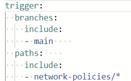
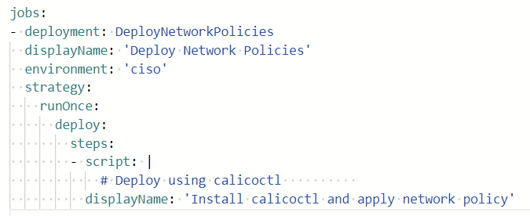
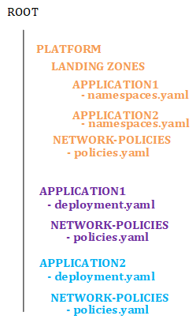

# East-West Traffic shared cluster and shared responsibilities using Calico

## Introduction

In a traditional Hub & Spoke topology, each application sits in its very own spoke virtual network and it is a common practice to let the application teams rule the intra-vnet traffic or at least not to route intra-vnet traffic to an external appliance. Any spoke to spoke traffic is however routed to an appliance to ensure that extra security controls take place when the application goes beyond its own boundaries. Inter-vnet traffic is often subject to firewall change requests and the security/network teams can approve/reject the various flows and have a complete oversight over the entire network landscape.

As highlighted in this GitHub repo and in this blob post, [AKS, the elephant in the Hub & Spoke room](https://techcommunity.microsoft.com/t5/microsoft-developer-community/aks-the-elephant-in-the-hub-amp-spoke-room-deep-dive/ba-p/3635985), a **shared** AKS cluster breaks the Hub & Spoke model because a single cluster cannot span multiple spokes, while still hosting multiple applications. If we were to make a network analogy, we could consider the cluster as the VNET and the namespace as a subnet. The problem is that in the Hub & Spoke model, all the subnets typically belong to a single application while a shared cluster hosts namespaces from various workloads. Moreover, often enough, a single application has more than one namespace. The challenge with this resides in the fact that it is harder to involve every stakeholder in the Cloud native world where everything is *as code*. 

The purpose of this page is to depict a possible approach.

## Stakeholders
In this scenario, we have the following stakeholders:

- Platform team, in charge of the deploying the infrastructure components of the shared AKS cluster. The team is also in charge of deploying the load balancers and global rules such as Global Network Policies. Among these global policies, a global deny as well as a global allow to DNS and platform services such as service meshes should be defined. At last, the platform team is also responsible to deploy what I would call *AKS landing zones*. Following the same idea of an Azure Landing Zone, we may consider that one or more namespaces represent the landing zone of a single application in AKS.

- Application teams, in charge of deploying their applications and their internal flows. Because an application might have one or more namespaces and because a namespace-scoped Network Policy will take precedence over the Global Deny policy, some extra checks will be required to prevent unexpected inter-application traffic.

- CISO departement, in charge of approving/rejecting network policies, for either application-scoped policies or both application and platform ones.

## Simplified high-level view of the CI/CD process


This view shows the logical blocks. The platform team has its own dedicated repo, as well as each application. Network policies can be subject to approval through the use of folder-specific pipelines that are triggered based on changes on the network folder:



The approval process takes place thanks to linking the job to a specific environment (CISO in this example):



This allows a security analyst to review changes and approve or reject them. You may as well only involve a security analyst upon pull requests including changes to this network policies folder. You'll adapt this approach according to the branching strategy you have opted for (Trunk, GitFlow GitLab, etc.). Now the challenge is to make sure the security analyst knows what he is supposed to approve/reject, as we can't expect everyone to be able to understand how Calico Network Policies work. That is what we'll see in the next section. 

## Organizing network policies and landing zones

### Platform level policies (global)
As stated earlier, the platform team is in charge of deploying global policies. For example, the following policy denies all traffic for the entire cluster except namespaces that are excluded:

```
apiVersion: projectcalico.org/v3
kind: GlobalNetworkPolicy
metadata:
  name: deny-all
spec:  
  selector: projectcalico.org/namespace not in  {'default','kube-system', 'calico-system', 'tigera-operator','gatekeeper-system','kube-public','kube-node-lease'}
  types:
  - Ingress
  - Egress
  ingress:
  - action: Deny
  egress:
  - action: Deny
---
```
This policy is far too restrictive since it locks down everything. You would typically allow traffic such as DNS resolution and access to various control planes such as Dapr, Istio, etc. when workloads are injected by sidecars that need to connect to their respective control plane but let's keep things simple. These global policies might also be subject to approval according the process and control you want to put in place. 

### AKS Landing Zones

As stated earlier, AKS breaks the Hub & Spoke model by default but nothing prevents us from creating a landing zone for each application that will be hosted in the shared cluster. A landing zone would typically consists of:

- One or more namespaces with various resource quotas defined at namespace level.
- One or more ingress/gateway rules should the application be exposed outside of the cluster.
- Possiblity, one or more dedicated node pools should the landing zone have specific compute requirements.

No matter how many namespaces you will end up with, you should label those namespaces with:

- The application code, which could be coming from your CMDB
- Potentially extra labels that could represent internal application layers.

For example, you might end up with namespaces belonging to a given landing zone that could look like this:

```
apiVersion: v1
kind: Namespace 
metadata:
  name: application2-ns1
  labels:
    applicationcode: application2
    zone: frontend
---
apiVersion: v1
kind: Namespace 
metadata:
  name: application2-ns2
  labels:
    applicationcode: application2
    zone: backend
---
apiVersion: v1
kind: Namespace 
metadata:
  name: application2-ns3
  labels:
    applicationcode: application2
    zone: data
---
```

The *application code* label makes it clear that they belong to a given application. The zones could define any boundary you'd like such as in this case *frontend*, *backend* and *data*. In a microservices world, these zones could rather be called *bounded context*. You define whatever you want. The benefit of using such labels is that you can let application teams define their own network policies. An example of such policies could be as follows:

```
apiVersion: projectcalico.org/v3
kind: NetworkPolicy
metadata:
  name: allow-frontend-to-backend-fromfe
  namespace: application2-ns1
spec:  
  selector: all()
  types:  
  - Egress  
  egress:
  - action: Allow
    destination:      
      namespaceSelector: "applicationcode == 'application2' && zone == 'backend'"    
      
---
apiVersion: projectcalico.org/v3
kind: NetworkPolicy
metadata:
  name: allow-frontend-to-backend-frombe
  namespace: application2-ns2
spec:  
  selector: all()
  types:  
  - Ingress
  - Egress  
  ingress:
  - action: Allow
    source:
      namespaceSelector: "applicationcode == 'application2' && zone == 'frontend'"            
  egress:
  - action: Allow
    destination:
      namespaceSelector: "applicationcode == 'application2' && zone == 'data'"     
      
---
apiVersion: projectcalico.org/v3
kind: NetworkPolicy
metadata:
  name: allow-intra-application-traffic
  namespace: application2-ns3
spec:  
  selector: all()
  types:
  - Ingress  
  ingress:
  - action: Allow
    source:
      namespaceSelector: "applicationcode == 'application2' && zone == 'backend'"        
---
```
In the above example, I defined an NTIER architecture (frontend, backend and data layers) and I define how layers can talk to each other within the application landing zone. With such an approach, **we can brief the security analyst to focus mostly on *selector* and *namespaceSelector* for which the *applicationcode* is ommited or wrong. In such a case, the application would leave its own boundaries, which should be subject to further investigation**.

I have crafted a full example which is available [here](../east-west-traffic/sharedclustersample/) to let you play and get started if you want to try out this approach. I come with the following structure to illustrate what I explained in the above sections:



Of course, in the target CI/CD platform, you would split that across different repos and follow your branching strategy. You could deploy network policies with Helm or Kustomize as you see fit. I used raw YAML to make it easy.

## Conclusion
It is possible to involve the security department in the review process and escape the traditional *Firewall Change Request* ticket by:

- Considering AKS Landing Zones, consisting of one or more namespaces dedicated to an application and identified as such.
- Leveraging the dynamic nature of network policies thanks to landing zone labels used in policy rules. 
- Leveraging CI/CD platforms to orchestrate everything and let CISO approve network policy changes.

## Remark

When managing shared clusters at scale, you should consider Enterprise-grade solutions such as Calico Enterprise, because they often with admin consoles spanning multiple clusters, which gives you a complete oversight of your K8s landscape. This remark applies to any technology (Service Meshes, etc.) that you plan to use as part of your reference architecture. 